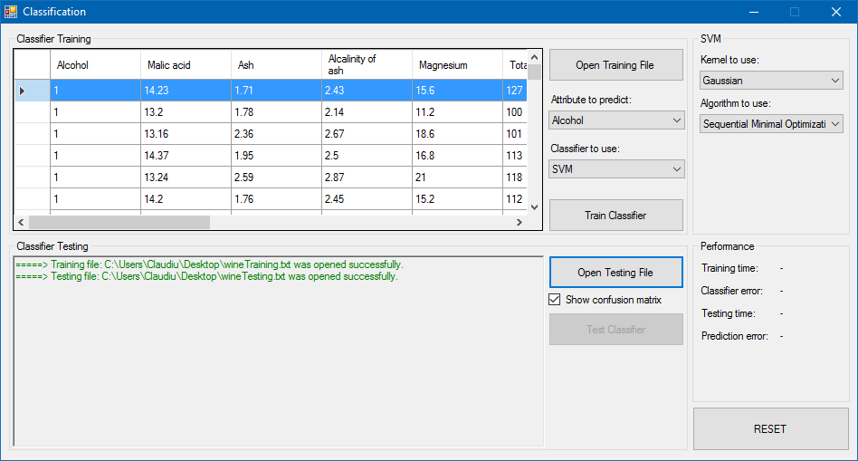

# Classification

> Data classification using Accord.NET framework.

This is a simple `C#` application developed in Visual Studio (using WinForms GUI) to explore some of the functionalities of the [Accord.NET framework](http://accord-framework.net/) regarding data classification. You can import some data in `.csv` format and compare the performances of different classification algorithms.

The following datasets were used to test the application:
* [Iris dataset](http://archive.ics.uci.edu/ml/datasets/Iris)
* [Wine dataset](http://archive.ics.uci.edu/ml/datasets/Wine)
* [Skin Segmentation Data Set](http://archive.ics.uci.edu/ml/datasets/Skin+Segmentation)
